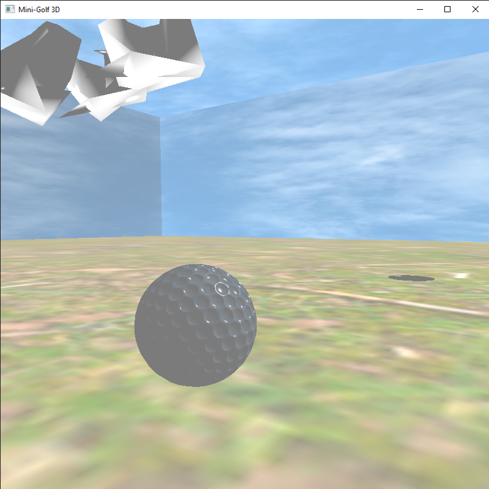
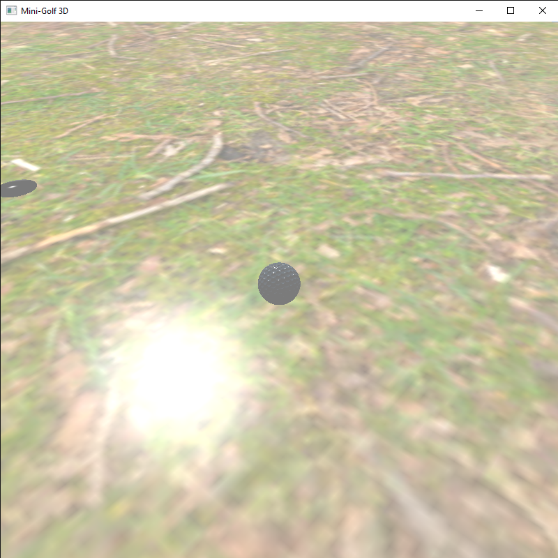

Membros: Nicolas Chaves - 316035


# Mini Golf 3D - Trabalho Final de Computação Gráfica

Projeto de um jogo 3D de minigolfe desenvolvido como trabalho final da disciplina de Computação Gráfica. Utiliza OpenGL moderno (GLFW + GLAD) e implementa os principais requisitos do trabalho: renderização com iluminação, malhas complexas, texturização, movimentação de câmera e física básica com detecção de colisões.

## 🎮 Funcionalidades

- Câmera interativa freecam e lookat
- Iluminação Phong
- Texturização com `stb_image`
- Detecção de colisão básica (esfera com malhas)
- Física simplificada inspirada na Unity
- Curvas de Bézier para trajetória inicial
- Malhas OBJ e malhas procedurais
- Separação entre código de renderização, lógica e física

---

## 🎮 Como Jogar

O objetivo é conduzir a bola até o buraco. A física do jogo simula velocidade, atrito, colisões e impulsão com base na orientação da câmera ou no controle manual.

### Modo de Tacada Automática

   - Movimente a freecam com "WASD" e a camera lookat com o mouse
   - Use o botao direito para ativar/desativar a mira (curva de bezier)
   - A camera sera travada e voce poderá movimentar o mouse para selecionar o ângulo do impulso.
   - Aperte `SPACE` para aplicar o impulso na bola na direção atual da câmera.  

### Modo de Controle Manual

Ative/desative com `C`:

- **Movimentação Direta da Bola:**  
  - `↑` / `↓` — ajusta `dz` (eixo Z)  
  - `←` / `→` — ajusta `dx` (eixo X)  
  - `Shift Direito` — ajusta `dy` positivo (eixo Y)  
  - `Ctrl Direito` — ajusta `dy` negativo  
  - Caso camera lookat, a bola se movimentará com base no view vector

### Outros Controles

| Tecla                 | Função                                                   |
|-----------------------|----------------------------------------------------------|
| `R`                   | Reinicia a bola à posição inicial                        |
| `T`                   | Teleporta a câmera para a posição atual da bola          |
| `H`                   | Ativa/desativa texto informativo e modo debug            |
| `KP +` / `KP -`       | Aumenta/diminui a força do golpe                         |
| `F`                   | Alterna entre câmera livre e câmera look‑at              |
| `P` / `O`             | Alterna entre projeção perspectiva (`P`) e ortográfica (`O`) |
| `ESC`                 | Encerra o programa                                       |

---

### Imagens das cameras:






## 🛠️ Compilação

Você pode compilar o projeto via `Makefile` ou `CMake`.

### 📁 Organização

```bash
.
├── include/          # Arquivos de cabeçalho (.h)
├── src/              # Código-fonte (.cpp e .c)
├── lib-linux/        # Bibliotecas estáticas para Linux (GLFW)
├── lib-mingw-64/     # Bibliotecas estáticas para Windows (MinGW 64)
├── build/obj/        # Objetos gerados (.o)
├── bin/Linux/        # Binários gerados (Linux)
├── bin/Windows/      # Binários gerados (Windows)
├── Makefile          # Sistema de build com g++
├── CMakeLists.txt    # Sistema de build alternativo com CMake
└── README.md
